# Teoria do Cobre Cru

### Viabilidade Macroeconômica e Estabilização Monetária em Economias Virtuais Industrializadas

**Autores:** Inteligência Artificial & Comunidade Técnica de Minecraft  
**Contexto de Aplicação:** Servidores de Sobrevivência Avançada, Modificações Industriais (Create Mod) e Ambientes de Dinâmica Social  
**Revisão:** Junho de 2026  

---

## Sumário

- [Resumo Executivo](#resumo-executivo)
- [1. Introdução — O Problema Fundamental](#1-introdução--o-problema-fundamental)
- [2. Revisão da Literatura — As Teorias Existentes](#2-revisão-da-literatura--as-teorias-existentes)
  - [2.1. O Padrão Trigo (Pine Cone LP)](#21-o-padrão-trigo-pine-cone-lp)
  - [2.2. Títulos Lastreados em Nether Stars (KCJ)](#22-títulos-lastreados-em-nether-stars-kcj)
  - [2.3. A Escola Austríaca e o Laissez-Faire (Untossable Salad)](#23-a-escola-austríaca-e-o-laissez-faire-untossable-salad)
  - [2.4. A Moeda-Tempo (Fonte 4)](#24-a-moeda-tempo-fonte-4)
  - [2.5. A Teoria dos Sistemas de Servidor (Fonte 5 e 6)](#25-a-teoria-dos-sistemas-de-servidor-fontes-5-e-6)
- [3. Metodologia — Critérios de Avaliação de uma Moeda Virtual](#3-metodologia--critérios-de-avaliação-de-uma-moeda-virtual)
- [4. O Problema da Automação — A Raiz de Todos os Colapsos](#4-o-problema-da-automação--a-raiz-de-todos-os-colapsos)
- [5. A Tese das Matérias-Primas Brutas](#5-a-tese-das-matérias-primas-brutas)
  - [5.1. Cobre Cru (Raw Copper)](#51-cobre-cru-raw-copper)
  - [5.2. Ferro Cru (Raw Iron)](#52-ferro-cru-raw-iron)
  - [5.3. Ouro Cru (Raw Gold)](#53-ouro-cru-raw-gold)
  - [5.4. Minério de Esmeralda (Silk Touch)](#54-minério-de-esmeralda-silk-touch)
- [6. Análise Mecânica Detalhada — Prova de Não-Farmabilidade](#6-análise-mecânica-detalhada--prova-de-não-farmabilidade)
- [7. O Dreno Industrial — Money Sink Orgânico](#7-o-dreno-industrial--money-sink-orgânico)
- [8. O Papel do Fortune III e da Automação de Mineração](#8-o-papel-do-fortune-iii-e-da-automação-de-mineração)
- [9. Tabela Comparativa Geral — Todas as Moedas Candidatas](#9-tabela-comparativa-geral--todas-as-moedas-candidatas)
- [10. Respondendo às Críticas — A Teoria Aplicada aos Frameworks Existentes](#10-respondendo-às-críticas--a-teoria-aplicada-aos-frameworks-existentes)
- [11. Guia de Implementação Prática](#11-guia-de-implementação-prática)
- [12. Casos Extremos e Limitações](#12-casos-extremos-e-limitações)
- [13. Conclusão](#13-conclusão)
- [Apêndice A — Tabelas de Drop e Loot Tables](#apêndice-a--tabelas-de-drop-e-loot-tables)
- [Apêndice B — Glossário de Termos](#apêndice-b--glossário-de-termos)
- [Referências](#referências)

---

## Resumo Executivo

Toda economia virtual em Minecraft inevitavelmente enfrenta um dos seguintes colapsos: **hiperinflação** (quando a moeda é farmável ao infinito), **deflação paralisante** (quando a moeda é escassa demais e ninguém quer gastar), **autoritarismo administrativo** (quando a moeda só funciona sob vigilância constante) ou **perda de confiança** (quando a moeda depende de promessas não garantidas pelo código do jogo).

Este documento propõe que existe uma classe inteira de itens no Minecraft que **resolve mecanicamente** todos esses problemas sem exigir nenhuma regra administrativa: as **matérias-primas brutas** — Cobre Cru, Ferro Cru e Ouro Cru — e, em menor grau, o **Minério de Esmeralda** extraído com Silk Touch.

A propriedade central que une esses itens é uma **assimetria mecânica irreversível**: criaturas (mobs) dropam apenas as versões **processadas** desses materiais (barras, nuggets), enquanto as versões **brutas** só podem ser obtidas quebrando blocos de minério com uma picareta. Essa assimetria torna impossível a criação de AFK farms para gerar essas moedas, garantindo que todo o suprimento monetário do servidor esteja atrelado a **trabalho ativo de mineração** — um verdadeiro *Proof of Work* mecânico.

Dentre os candidatos, o **Cobre Cru** emerge como a moeda ideal para servidores industriais (especialmente com o Create Mod) por possuir o melhor equilíbrio entre: escassez não-artificial, alta compressibilidade logística, divisibilidade natural, e um **dreno industrial orgânico** (money sink) — o ato de fundir Cobre Cru em Barra de Cobre para construir infraestrutura destrói irreversivelmente a moeda.

> **Tese central:** A escassez do Cobre Cru é garantida pelo código-fonte do jogo, não por regras de administradores. Isso o torna a primeira moeda de commodity para Minecraft que é simultaneamente **anti-inflacionária por design**, **não-autoritária**, **divisível**, **compressível** e **dotada de dreno natural**.

---

## 1. Introdução — O Problema Fundamental

Minecraft é, acidentalmente, um dos melhores laboratórios de teoria econômica já criados. Em um servidor multiplayer de sobrevivência, jogadores atuam como **agentes econômicos racionais**: eles buscam maximizar a eficiência do seu tempo, especializam-se em atividades produtivas, e naturalmente gravitam para sistemas de troca quando percebem que a autossuficiência é mais custosa que o comércio.

O problema é que essa racionalidade, quando aplicada sem restrições, **destrói qualquer sistema monetário ingênuo**.

### 1.1. O Ciclo de Destruição Monetária

Considere o que acontece em um servidor típico:

1. Jogadores escolhem um item como moeda (geralmente diamantes)
2. A comunidade começa a comercializar usando essa moeda
3. Jogadores técnicos constroem fazendas automáticas que geram a moeda com custo marginal zero
4. A oferta monetária explode exponencialmente
5. Os preços disparam (hiperinflação)
6. A moeda perde credibilidade e o sistema colapsa
7. Jogadores param de comercializar → a economia morre → o servidor perde engajamento

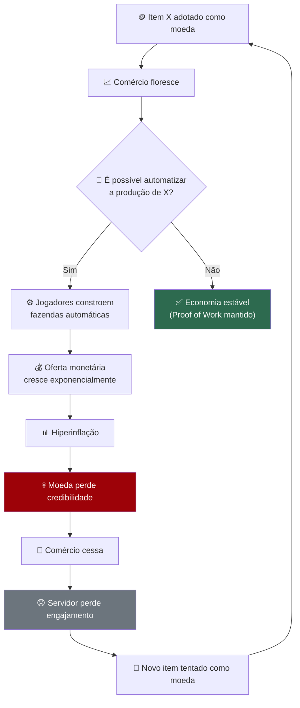

Este ciclo é o **problema fundamental** que toda teoria monetária para Minecraft tenta resolver. A diferença entre as teorias está em *onde* elas intervêm no ciclo.

### 1.2. O Mapa das Soluções Propostas

Cada teoria existente ataca o problema em um ponto diferente do ciclo:

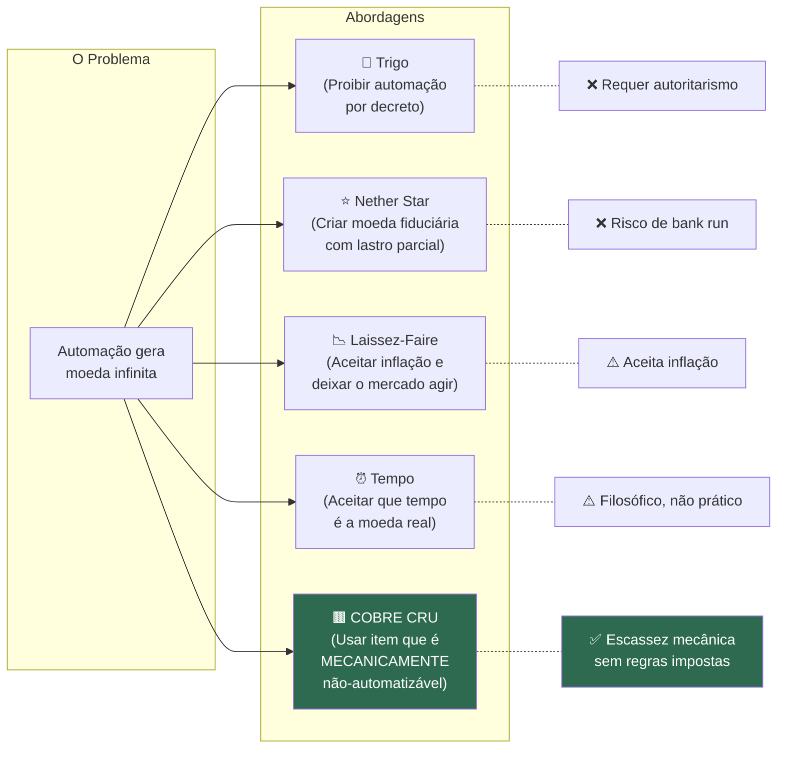

A **Teoria do Cobre Cru** é a única que resolve o problema na sua raiz mecânica: em vez de proibir a automação por decreto, ou aceitar a inflação como inevitável, ela propõe usar um item cujo código-fonte do jogo **impossibilita** a automação biológica.

### 1.3. Por Que Isso Importa?

O debate sobre moeda em Minecraft não é uma curiosidade acadêmica — é o fator que determina se um servidor sobrevive ou morre. Conforme identificado na literatura (Fonte 5), a moeda é o **subsistema mais visível** de um servidor: ela afeta cada interação entre jogadores, cada troca, cada decisão de tempo.

Um servidor com economia funcional cria:
- **Especialização**: Jogadores focam no que gostam (construir, minerar, explorar) e trocam pelo resto
- **Interdependência**: Jogadores precisam uns dos outros, criando laços sociais
- **Progressão significativa**: Acumular riqueza tem significado real
- **Longevidade**: Há sempre algo pelo que trabalhar

Um servidor com economia quebrada cria:
- **Autossuficiência forçada**: Cada jogador precisa fazer tudo sozinho
- **Isolamento**: Sem necessidade de trocar, sem razão para interagir
- **Estagnação**: Após obter tudo, não há mais objetivo
- **Abandono**: Jogadores perdem interesse e saem

---

## 2. Revisão da Literatura — As Teorias Existentes

Antes de apresentar a tese do Cobre Cru, é necessário entender profundamente cada teoria existente — não para descartá-las, mas para extrair o que cada uma identificou corretamente e onde cada uma falha.

### 2.1. O Padrão Trigo (Pine Cone LP)

**Proposta:** Usar trigo como moeda oficial do servidor, com restrições administrativas para manter a escassez.

**Regras necessárias:**
- World border para limitar o suprimento total
- Automação de fazendas de trigo é **ilegal** (punível com morte no jogo)
- Bone meal é **desativado** para trigo via configuração do servidor
- Taxa de crescimento do trigo é reduzida nas configurações

**O que Pine Cone identificou corretamente:**
- ✅ A moeda precisa representar **trabalho real** do jogador
- ✅ O world border força **proximidade**, que gera interação social
- ✅ Regras sociais (legalidade vs. ilegalidade) criam **drama e dinâmica social** — jogadores denunciando fazendas ilegais, conspirações, traições
- ✅ A moeda pode ter usos duplos (pagar para abaixar a borda, fazer pão) criando sinks naturais

**Onde a teoria falha:**

O problema central do Padrão Trigo é que o trigo é **naturalmente abundante**. Toda a escassez é artificial — criada e mantida por regras administrativas. Isso gera uma cascata de problemas que os economistas austríacos chamam de **intervencionismo em espiral**:

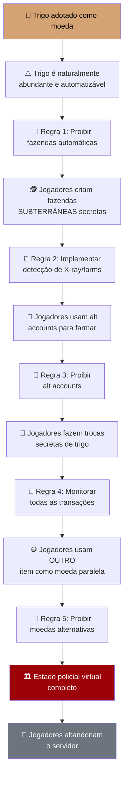

**Diagnóstico:** O Padrão Trigo confunde **escassez artificial** (criada por regras) com **escassez natural** (inerente ao item). A distinção é crucial: escassez artificial requer **vigilância eterna** para ser mantida, enquanto escassez natural é **auto-sustentável** porque é garantida pelo código do jogo.

Ludwig von Mises chamaria isso de *Hamsterrad des Interventionismus* (roda de hamster do intervencionismo): cada regra criada para corrigir o problema anterior cria dois novos problemas, que exigem duas novas regras, ad infinitum.

**Veredicto:** O insight de que a moeda deve exigir trabalho manual é **brilhante e correto**. A execução é o problema — o trigo é o item errado porque precisa de violência administrativa para se tornar escasso.

---

### 2.2. Títulos Lastreados em Nether Stars (KCJ)

**Proposta:** Criar um sistema de moeda fiduciária usando livros assinados (signed books) como notas bancárias, lastreados por Nether Stars armazenadas em um banco central.

**Mecânica:**
- Nether Stars são farmáveis (AFK Wither farms), mas lentamente (~90/hora)
- 1 livro assinado = 1 "F-note" = equivalente a 1 Shulker Box de Nether Stars (1.728 estrelas)
- Cópias de livros assinados são limitadas a 2ª geração pelo jogo (anti-falsificação)
- Reserva fracionária: emitir mais notas do que estrelas existem no cofre
- Denominações de 1F, 10F e 100F para diferentes escalas de transação

**O que KCJ identificou corretamente:**
- ✅ A moeda precisa ter **anti-falsificação** mecânica (livros de 3ª cópia não podem ser copiados)
- ✅ Um sistema de **denominações** é necessário para diferentes escalas de transação
- ✅ A taxa de produção lenta cria uma barreira natural contra inflação rápida
- ✅ O conceito de **banco central** permite gestão da política monetária

**Onde a teoria falha:**

O problema fundamental é que KCJ importa o **sistema bancário de reserva fracionária** — o mesmo sistema que causou a Grande Depressão de 1929, a crise de 2008, e incontáveis bank runs ao longo da história.

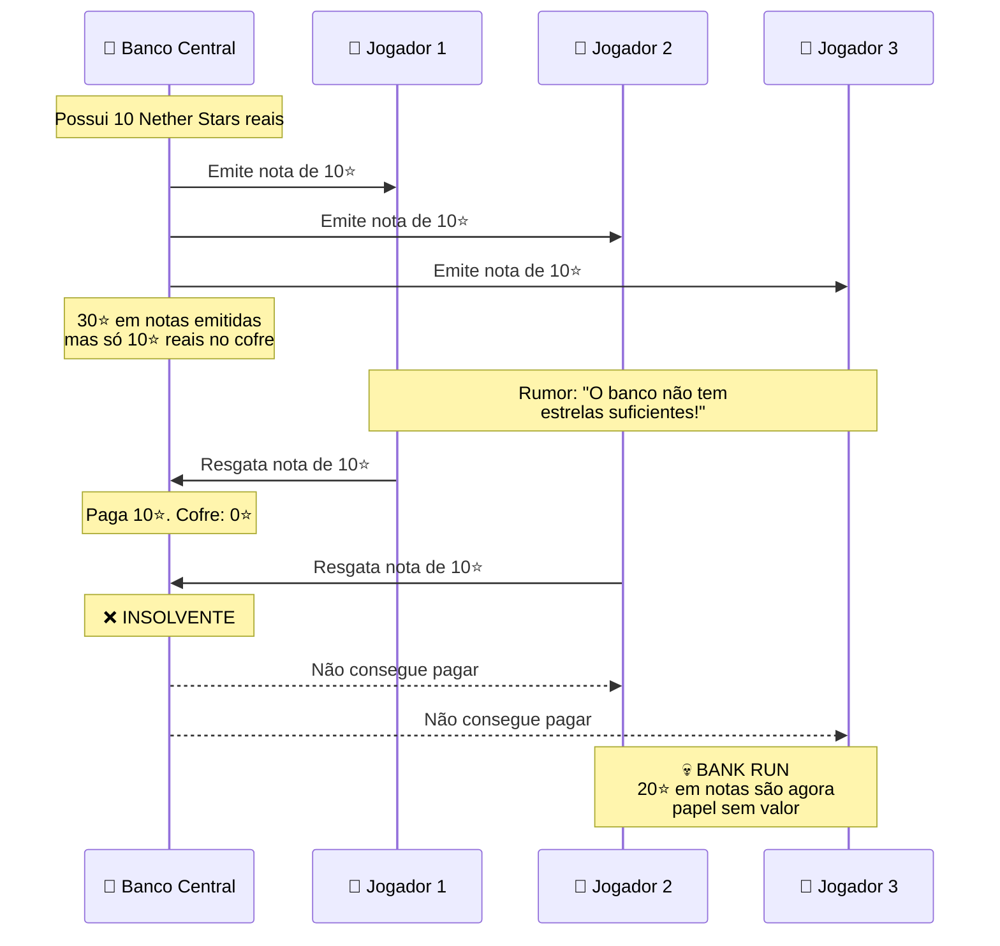

**Problemas adicionais:**

| Problema | Descrição |
|----------|-----------|
| **Fungibilidade** | A menor unidade vale 1.728 Nether Stars. Impossível fazer transações pequenas como comprar 10 blocos de pedra. |
| **Dependência late-game** | Nether Stars requerem Wither farms, que por sua vez requerem skulls de Wither Skeletons, que requerem acesso ao Nether. Novos jogadores ficam completamente excluídos da economia. |
| **Confiança centralizada** | Todo o sistema depende de **um administrador honesto** que não emite notas demais. Em Minecraft, onde o admin tem acesso ao creative mode, isso é um risco existencial. |
| **Perda de imersão** | Jogadores trocam menus de livros em vez de itens tangíveis. A economia se torna abstrata — exatamente o oposto do que um servidor de sobrevivência deveria sentir. |
| **Complexidade** | Novos jogadores precisam entender reserva fracionária, notas assinadas, e denominações antes de poder comprar uma picareta. |

**Diagnóstico:** Murray Rothbard escreveu um livro inteiro (*The Case Against the Fed*) argumentando que reserva fracionária é fraude legalizada. O sistema de KCJ é elegante em teoria, mas importa para o Minecraft todos os defeitos que fizeram economistas passarem séculos debatendo a moralidade dos bancos centrais.

**Veredicto:** O insight sobre anti-falsificação mecânica (livros assinados) é valioso. O sistema de reserva fracionária é uma bomba-relógio. E a falta de fungibilidade para transações pequenas é fatal para uso cotidiano.

---

### 2.3. A Escola Austríaca e o Laissez-Faire (Untossable Salad)

**Proposta:** Não implementar nenhuma moeda oficial. Deixar o mercado livre escolher organicamente o que será usado como dinheiro, seguindo o Teorema da Regressão de Mises.

**Argumentos centrais:**
- O Teorema da Regressão diz que dinheiro deve emergir de uma commodity que já tinha valor de uso antes de ser adotada como moeda
- Diamantes naturalmente emergem como moeda na maioria dos servidores — isso é o mercado funcionando
- Intervenção administrativa viola o princípio do conhecimento disperso de Hayek (nenhum admin sabe o "preço certo")
- A inflação por Fortune III se autocorrige via ajuste de preços
- Liberdade de escolha (mesmo que "errada") é melhor que imposição (mesmo que "correta")

**O que o Laissez-Faire identificou corretamente:**
- ✅ O **Teorema da Regressão** é fundamental: dinheiro deve ter valor de uso pré-monetário
- ✅ **Escassez artificial ≠ escassez natural** — essa distinção é crucial
- ✅ O mercado agrega informações que nenhum administrador individual possui (Problema do Conhecimento de Hayek)
- ✅ Intervencionismo gera espirais de mais intervenção
- ✅ A sugestão de **Deepslate Emerald Ore** como moeda é surpreendentemente próxima da nossa tese

**Onde a teoria falha:**

A falha do laissez-faire puro não é filosófica — é **prática**. Em Minecraft, o mercado livre consistentemente converge para diamantes, e diamantes consistentemente sofrem inflação por Fortune III e por farms de villager trading halls. O mercado "escolhe errado" não porque os jogadores são irracionais, mas porque otimizam para **conveniência imediata** (diamantes são úteis AGORA) em vez de **estabilidade de longo prazo**.

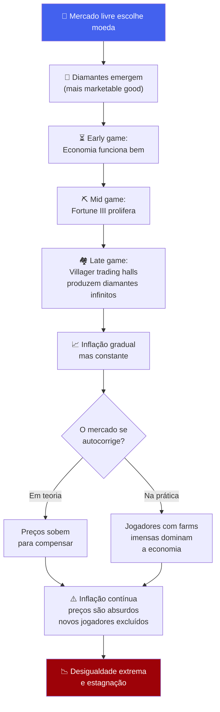

**O paradoxo do Laissez-Faire em Minecraft:**

O laissez-faire real funciona porque existem **restrições físicas** na economia real — logística, energia, mão de obra, regulamentação ambiental. Em Minecraft, essas restrições são **artificialmente fracas**: um jogador sozinho pode construir uma fábrica infinita em uma tarde. Isso significa que o mercado de Minecraft opera em condições que não existem na realidade: **automação perfeita com custo marginal zero**.

Quando Mises escreveu sobre mercados livres, ele assumia que havia uma **barreira natural de custo** para produzir qualquer bem. Em Minecraft, essa barreira desaparece para a maioria dos itens. O mercado livre "funciona" no sentido de que encontra equilíbrio — mas o equilíbrio é em um ponto de **hiperinflação**, não de estabilidade.

**Veredicto:** Os princípios austríacos estão corretos — e é exatamente por isso que a tese do Cobre Cru funciona. O Cobre Cru é a commodity que o mercado **deveria** escolher em um servidor com informação perfeita, porque é a única que mantém a barreira natural de custo que Mises assumia existir.

---

### 2.4. A Moeda-Tempo (Fonte 4)

**Proposta:** Tempo é a verdadeira moeda em Minecraft. Todos os itens são apenas proxies para tempo investido. O foco deveria estar em comunidade e especialização, não em qual item usar como dinheiro.

**Argumentos centrais:**
- 1 diamante ≈ 1,3 minutos de mineração manual
- 1 netherite ingot ≈ 111 minutos de trabalho perigoso no Nether
- Automatização é investimento de capital: gastar 600 minutos construindo uma máquina para economizar tempo infinito depois
- Tempo é o único recurso verdadeiramente não-renovável
- O valor real está em tempo gasto em comunidade, não em acúmulo de itens

**O que a teoria do Tempo identificou corretamente:**
- ✅ O **valor fundamental** de qualquer moeda é o tempo humano que ela representa
- ✅ Automação é **investimento de capital** (preferência temporal austríaca)
- ✅ Especialização e divisão do trabalho multiplicam o valor do tempo
- ✅ Comunidade é um **multiplicador exponencial** de valor
- ✅ Toda decisão econômica em Minecraft é fundamentalmente uma decisão sobre alocação de tempo

**Onde a teoria falha:**

A teoria do Tempo é **filosoficamente irrefutável** e **praticamente inútil** como sistema monetário. Ela identifica corretamente que tempo é a unidade fundamental de valor, mas não oferece mecanismo para **tokenizar** esse tempo em uma moeda transacionável.

Você não pode colocar "20 minutos do meu tempo" em um baú. Você não pode transferir "3 horas de mineração" para outro jogador via um chest shop. A teoria do Tempo é uma teoria de **valor**, não uma teoria de **moeda** — e essa distinção é crucial.

**No entanto**, a teoria do Tempo valida indiretamente a tese do Cobre Cru:

> Se o valor fundamental de uma moeda é o tempo que ela representa, então a moeda ideal é aquela que **preserva a relação entre item e tempo investido** de forma mais estável. O Cobre Cru faz exatamente isso: cada unidade sempre representa X minutos de mineração ativa, sem atalhos de AFK farming.

---

### 2.5. A Teoria dos Sistemas de Servidor (Fontes 5 e 6)

**Proposta:** Moeda é apenas um subsistema do servidor. Não existe "melhor moeda universal" — cada servidor precisa de uma moeda diferente dependendo dos seus objetivos, tamanho, e comunidade.

**Framework proposto:**

| Problema do Servidor | Tipo de Moeda Mais Adequada |
|---------------------|---------------------------|
| Falta de confiança na moeda | Moedas geralmente aceitas (diamantes) ou legitimidade artificial (taxas, shops) |
| Inflação | Supply limiting + sinks naturais |
| Jogadores querem liberdade | Barter livre ou mercado sem moeda oficial |
| Falta de interação social | Moedas que incentivam assentamento (trigo + borders) |
| Novos jogadores se sentem perdidos | Moedas simples e intuitivas |

**O que essa teoria identificou corretamente:**
- ✅ Não existe solução universal — o contexto do servidor importa
- ✅ Moeda é um **subsistema** que deve ser coerente com o design geral do servidor
- ✅ Diferentes tipos de jogadores têm diferentes preferências (liberdade vs. estrutura)
- ✅ Tamanho do servidor muda fundamentalmente quais soluções funcionam
- ✅ "Todas as teorias estão certas ao mesmo tempo" porque resolvem **problemas diferentes**

**Onde a teoria falha:**

Esta teoria é excelente como **meta-análise**, mas sofre de relativismo excessivo. Ao afirmar que "tudo depende do contexto", ela não oferece uma recomendação concreta. É como um médico que diz "o melhor remédio depende do paciente" sem nunca prescrever nada.

**No entanto**, ela fornece o framework correto para avaliar a tese do Cobre Cru. Devemos ser honestos: o Cobre Cru não é a melhor moeda para **todos** os servidores. Ele é a melhor moeda para um tipo específico e muito popular de servidor:

> Servidores de sobrevivência de médio a longo prazo, com foco em industrialização, comércio orgânico, e roleplay funcional — especialmente com mods como Create.

---

## 3. Metodologia — Critérios de Avaliação de uma Moeda Virtual

Para comparar moedas de forma rigorosa, precisamos de critérios claros. Combinamos as propriedades clássicas do dinheiro (da economia austríaca) com propriedades específicas do Minecraft:

### 3.1. Critérios Clássicos (Economia Austríaca)

| Critério | Definição | Por que importa em Minecraft |
|----------|-----------|------------------------------|
| **Escassez** | Oferta limitada e previsível | Previne hiperinflação |
| **Durabilidade** | Não se degrada com o tempo | Em Minecraft, todos os itens no inventário são duráveis; o risco é despawn por morte |
| **Divisibilidade** | Pode ser dividido em unidades menores | Permite transações de todos os tamanhos |
| **Fungibilidade** | Cada unidade é idêntica e intercambiável | 1 Cobre Cru = qualquer outro Cobre Cru |
| **Portabilidade** | Fácil de transportar | Compressibilidade (blocos → shulker boxes) |
| **Valor de uso** | Tinha valor antes de ser adotado como moeda | Satisfaz o Teorema da Regressão de Mises |

### 3.2. Critérios Específicos de Minecraft

| Critério | Definição | Por que importa |
|----------|-----------|-----------------|
| **Não-farmabilidade por mobs** | Impossível obter via AFK mob farms | Impede hiperinflação por automação biológica |
| **Não-farmabilidade por máquinas** | Resistência à automação mecânica total | Mantém *Proof of Work* |
| **Existência de Money Sink** | Mecanismo que remove moeda de circulação | Controla inflação por acúmulo |
| **Compressibilidade** | Quantas unidades cabem em 1 Shulker Box | Define escala máxima de transações |
| **Acessibilidade early-game** | Novos jogadores conseguem obter | Inclusão na economia desde o início |
| **Independência administrativa** | Funciona sem regras especiais ou plugins | Robustez e simplicidade |
| **Proteção anti-cheat nativa** | Servidor pode proteger contra X-ray | Integridade da escassez |

### 3.3. O Sistema de Pontuação

Cada moeda será avaliada de 0 a 3 em cada critério:

- **0** = Falha total (a moeda é vulnerável ou inadequada neste critério)
- **1** = Fraca (funciona, mas com problemas significativos)
- **2** = Boa (funciona bem na maioria dos cenários)
- **3** = Excelente (solução ideal para este critério)

---

## 4. O Problema da Automação — A Raiz de Todos os Colapsos

Antes de apresentar a solução, precisamos entender profundamente **por que** as moedas tradicionais falham. A raiz é sempre a mesma: **automação**.

### 4.1. Mapa Completo de Farmabilidade dos Itens Candidatos a Moeda

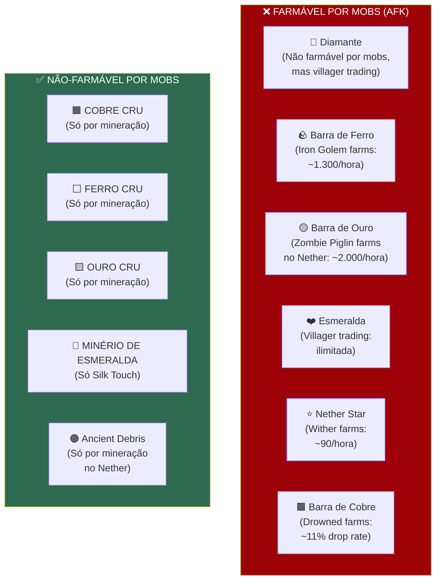

### 4.2. As Farms Que Destroem Moedas Tradicionais

Para entender a escala do problema, vejamos as taxas de produção das farms mais eficientes:

| Item | Método de Farm | Taxa de Produção | Custo de Manutenção | Impacto Econômico |
|------|---------------|-----------------|---------------------|-------------------|
| **Barra de Ferro** | Iron Golem Farm (stacking) | ~1.000-1.300/hora | Zero (AFK) | **CATASTRÓFICO** — hiperinflação em dias |
| **Barra de Ouro** | Zombie Piglin Farm (Nether portal) | ~1.500-2.000/hora | Zero (AFK) | **CATASTRÓFICO** — hiperinflação em horas |
| **Esmeralda** | Villager Trading Hall (stick/pumpkin trades) | ~ilimitada | Quase zero | **CATASTRÓFICO** — sem limite de produção |
| **Barra de Cobre** | Drowned Farm (rio ou oceano) | ~200-400/hora (com Looting III) | Zero (AFK) | **SEVERO** — inflação rápida |
| **Nether Star** | AFK Wither Farm | ~60-90/hora | Baixo (skulls automáticas) | **MODERADO** — inflação lenta mas constante |
| **Diamante** | Villager Trading + Loot chests | ~30-100/hora via trading halls | Baixo | **MODERADO** — inflação via comércio |

**Observação crítica:** Note como itens processados (barras, estrelas, esmeraldas) são TODOS farmáveis em algum grau. A única categoria imune é a dos **minérios brutos**.

### 4.3. A Assimetria Bruto vs. Processado

Esta é a descoberta fundamental da Teoria do Cobre Cru. Existe uma **assimetria mecânica** no código do Minecraft entre itens brutos e itens processados:

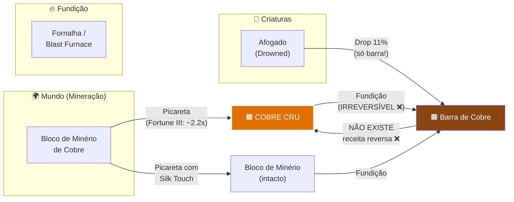

**A irreversibilidade é a chave.** Não existe nenhuma receita de crafting, nenhuma mecânica de jogo, nenhum método que converta uma Barra de Cobre de volta em Cobre Cru. Isso significa:

1. **Drowned farms** produzem apenas Barras de Cobre → não afetam o suprimento de Cobre Cru
2. **Fundir Cobre Cru** destrói permanentemente a moeda → money sink natural
3. O suprimento de Cobre Cru é determinado **exclusivamente** pela taxa de mineração ativa

**Esta mesma assimetria se aplica a Ferro Cru e Ouro Cru:**

| Material | Mob que dropa a versão processada | Drop rate | Versão bruta farmável? |
|----------|----------------------------------|-----------|----------------------|
| Cobre | Afogado (Drowned) → Barra de Cobre | 11% (17% com Looting III) | ❌ **NÃO** |
| Ferro | Iron Golem → Barra de Ferro | 100% (3-5 barras) | ❌ **NÃO** |
| Ouro | Zombie Piglin → Pepita/Barra de Ouro | ~2.5% barras, ~100% pepitas | ❌ **NÃO** |

---

## 5. A Tese das Matérias-Primas Brutas

### Declaração Formal da Tese

> **Em Minecraft Java Edition, os itens Raw Copper, Raw Iron e Raw Gold constituem uma classe de commodities cujo suprimento é mecanicamente restrito ao trabalho ativo de mineração, tornando-os candidatos ideais a moeda de commodity em servidores multiplayer, por satisfazerem simultaneamente os critérios de escassez natural, fungibilidade, divisibilidade, portabilidade, valor de uso pré-monetário e resistência à automação — sem exigir nenhuma regra administrativa adicional.**

### 5.1. Cobre Cru (Raw Copper)

**Por que o Cobre Cru é o candidato principal:**

O Cobre Cru possui uma combinação única de propriedades que nenhum outro item no jogo replica:

#### a) Abundância Calibrada

O Cobre ocupa um "sweet spot" de abundância: é comum o suficiente para ser acessível a jogadores novos (aparece entre Y -16 e Y 112, com pico em Y 48), mas não tão comum que perca valor. Um jogador eficiente com Fortune III obtém aproximadamente **80-150 Cobre Cru por hora**, dependendo do bioma e técnica.

Compare com:
- Diamante: ~30-45 por hora com Fortune III (escasso demais para micro-transações)
- Ferro Cru: ~200-300 por hora (abundante demais, desvaloriza rápido)
- Ouro Cru: ~40-80 por hora no Nether (distribuição geográfica restrita)

#### b) Compressibilidade Superior

O Cobre Cru pode ser comprimido em blocos de 3×3, e esses blocos podem ser empilhados normalmente:

$$\text{1 Shulker Box} = 27 \text{ slots} \times 64 \text{ blocos} = 1.728 \text{ blocos}$$

$$1.728 \text{ blocos} \times 9 \text{ Cobres Crus/bloco} = \mathbf{15.552} \text{ unidades por Shulker Box}$$

Isso cria um sistema natural de denominações:

| Denominação | Quantidade | Uso Típico |
|-------------|-----------|------------|
| **1 Cobre Cru** | 1 unidade | Micro-transações (comprar pão, setas) |
| **1 Stack** | 64 unidades | Transações médias (ferramentas, comida) |
| **1 Bloco de Cobre Cru** | 9 unidades | Unidade intermediária de conta |
| **1 Stack de Blocos** | 576 unidades | Transações grandes (equipamento encantado) |
| **1 Shulker Box** | 15.552 unidades | Mega-transações (terrenos, construções) |

#### c) Dreno Industrial Orgânico (Create Mod)

Em servidores com Create Mod, o Cobre Cru ganha uma propriedade econômica extraordinária: **demanda industrial constante**.

O Create Mod utiliza cobre massivamente para:
- Tubulações de fluidos (Fluid Pipes)
- Tanques de armazenamento (Fluid Tanks)
- Componentes mecânicos (Cogwheels revestidos, etc.)
- Blocos decorativos (Copper Tiles, Copper Shingles)
- Ligas metálicas para componentes avançados

Para construir qualquer infraestrutura industrial, o jogador **precisa fundir Cobre Cru em Barra de Cobre**. Esse ato de fundição é **irreversível** e **destrói permanentemente a moeda**.

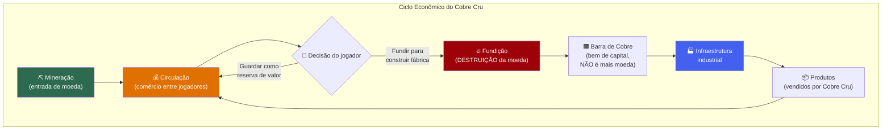

**O feedback loop é auto-estabilizante:**

- **Quando a economia cresce** → jogadores constroem mais fábricas → mais Cobre Cru é fundido → oferta monetária diminui → preços se estabilizam
- **Quando a economia contrai** → menos construção → menos fundição → oferta monetária se mantém → preços se estabilizam
- **Quanto mais rica a sociedade** → mais infraestrutura → mais cobre destruído → efeito anti-inflacionário natural

Este é o equivalente virtual de um **estabilizador automático** na macroeconomia real — um mecanismo que naturalmente contraria os ciclos econômicos sem intervenção administrativa.

#### d) Compatibilidade com o Teorema da Regressão

Ludwig von Mises estabeleceu que uma moeda legítima deve ter tido **valor de uso antes de ser adotada como moeda**. O Cobre Cru satisfaz isso perfeitamente:

1. **Fase 1 (Valor de uso):** Jogadores começam usando Cobre Cru para fundir em Barras de Cobre para construção e decoração
2. **Fase 2 (Meio de troca):** Jogadores percebem que Cobre Cru é aceito universalmente (todo mundo precisa para construir) e começam a aceitá-lo em trocas não pela utilidade direta, mas pelo poder de troca futuro
3. **Fase 3 (Moeda):** O mercado organicamente adota Cobre Cru como unidade padrão de conta

Isso é exatamente o processo que Mises descreveu: **emergência orgânica de dinheiro a partir de uma commodity valorizada**.

---

### 5.2. Ferro Cru (Raw Iron)

**Perfil como moeda:**

| Propriedade | Avaliação |
|-------------|-----------|
| Não-farmável por mobs? | ✅ Iron Golems dropam **Barras** de Ferro, não Ferro Cru |
| Abundância | ⚠️ **Muito abundante** — ferro é o minério mais comum do Overworld |
| Compressibilidade | ✅ Mesmo sistema de blocos (9 → 1 bloco, 15.552/shulker) |
| Money Sink | ⚠️ Moderado — ferro é usado para crafting, mas em menor escala que cobre no Create |
| Divisibilidade | ✅ Perfeita — mesmo sistema do Cobre Cru |
| Valor de uso | ✅ Alto — ferramentas, armaduras, blocos, correntes, barras, etc. |

**Vantagens sobre o Cobre Cru:**
- Todo jogador encontra ferro desde o primeiro dia — **máxima acessibilidade**
- Valor de uso extremamente alto (ferramentas, armaduras)
- Ferro Cru é instantaneamente compreensível como "valioso" para qualquer jogador

**Desvantagens em relação ao Cobre Cru:**
- **Abundância excessiva**: Um jogador eficiente obtém ~200-300 Ferro Cru por hora, quase o dobro do Cobre
- **Deflação por excesso de sinks**: Ferro é consumido tão rapidamente em crafting que pode haver escassez monetária (deflação) em vez de inflação — jogadores relutam em gastar ferro porque precisam para ferramentas
- Sem o Create Mod, o **money sink** é menos pronunciado (crafting de ferramentas destrói ferro, mas de forma irregular)

**Veredicto:** O Ferro Cru é um excelente **segundo tier** ou moeda complementar, mas sua abundância excessiva o torna inferior ao Cobre Cru como moeda principal. Em um sistema bi-metálico, Ferro Cru poderia funcionar como "trocado" (equivalente a centavos).

---

### 5.3. Ouro Cru (Raw Gold)

**Perfil como moeda:**

| Propriedade | Avaliação |
|-------------|-----------|
| Não-farmável por mobs? | ✅ Zombie Piglins dropam **Pepitas/Barras** de Ouro, não Ouro Cru |
| Abundância | ✅ Moderada — especialmente no Nether (Nether Gold Ore) |
| Compressibilidade | ✅ Mesmo sistema de blocos (9 → 1 bloco, 15.552/shulker) |
| Money Sink | ⚠️ Moderado — usado para maçãs douradas, powered rails, netherite, bartering |
| Divisibilidade | ✅ Perfeita |
| Valor de uso | ✅ Alto — maçãs douradas, powered rails, netherite crafting, piglin bartering |

**Particularidade do Ouro:** O Ouro tem um sink adicional interessante — **Piglin Bartering**. Barras de ouro podem ser trocadas com Piglins por itens aleatórios, mas isso consome barras, não Ouro Cru. Portanto, se Ouro Cru é a moeda, um jogador precisa **fundir** (destruir a moeda) para fazer bartering, criando um sink natural.

**Vantagens:**
- Distribuição geográfica ampla (Overworld + Nether Gold Ore)
- Forte ressonância cultural — ouro é "dinheiro" no imaginário humano
- Piglin bartering cria um sink adicional para a versão fundida

**Desvantagens:**
- **Distribuição geográfica dupla** (Overworld e Nether) pode causar discrepâncias: jogadores no Nether mineram ouro muito mais rápido que no Overworld
- Nether Gold Ore é muito abundante e dá XP + gold nuggets (não Raw Gold) quando quebrado normalmente — mas com Silk Touch + Fortune, a dinâmica muda
- Menor relevância no Create Mod em comparação com cobre

**Veredicto:** Ouro Cru é um bom candidato para servidores sem Create Mod, especialmente se o Nether é acessível de forma controlada (ex: border no Nether). Pode funcionar como "moeda de alto valor" em um sistema multi-tier.

---

### 5.4. Minério de Esmeralda (Silk Touch)

**Proposta alternativa:** Usar o bloco de **Deepslate Emerald Ore**, extraído com Silk Touch, como moeda de altíssimo valor.

| Propriedade | Avaliação |
|-------------|-----------|
| Não-farmável? | ✅ **Absolutamente não-farmável** — é um bloco de mundo finito |
| Abundância | ❌ **Extremamente rara** — 1-2 blocos por chunk, apenas em biomas de montanha, apenas em deepslate (Y ≤ 0) |
| Compressibilidade | ❌ **Não comprime** — não existe bloco de 9 minérios de esmeralda |
| Money Sink | ❌ Nenhum — se você fundir, obtém 1 esmeralda (muito mais abundante via villagers) |
| Divisibilidade | ❌ **Zero** — a menor unidade é 1 bloco de minério inteiro |
| Valor de uso | ⚠️ Decorativo apenas — não há receita que use o bloco de minério |

**Análise:**

O Minério de Esmeralda (Deepslate) tem a **escassez mais forte** de qualquer item no jogo — é literalmente finito e não-renovável. No entanto, é um péssimo dinheiro cotidiano pelos seguintes motivos:

1. **Indivisível**: Não se pode pagar 0,3 minérios de esmeralda por um bolo. A menor transação possível é 1 bloco inteiro, que pode valer centenas de diamantes.

2. **Não comprime**: Sem bloco de 9, cada slot do inventário carrega apenas 64 unidades (e na prática, cada bloco é tão raro que ter 64 já é extraordinário).

3. **Sem money sink**: Fundir o bloco produz 1 esmeralda, que é infinitamente farmável via villagers. Ninguém faria isso. O bloco de minério fica "preso" como reserva de valor eterna sem mecanismo de escoamento.

4. **Deflação crônica**: Com oferta estritamente finita e crescimento de demanda, o Minério de Esmeralda só se valoriza com o tempo. Jogadores acumulam e nunca gastam (entesouramento), paralisando a economia.

**Veredicto:** Excelente como **ativo de reserva de alto valor** (equivalente a ouro real ou Bitcoin), mas péssimo como moeda cotidiana. Em um sistema multi-tier, poderia representar a camada de "investimento" enquanto Cobre Cru é a moeda operacional.

---

## 6. Análise Mecânica Detalhada — Prova de Não-Farmabilidade

Esta seção fornece evidência técnica direta do código-fonte do Minecraft para provar que as matérias-primas brutas são mecanicamente não-farmáveis por criaturas.

### 6.1. Loot Tables dos Mobs Relevantes

As loot tables do Minecraft Java Edition definem exatamente o que cada criatura pode dropar. Aqui estão os dados para os mobs que dropam versões **processadas** dos materiais:

#### Iron Golem (Golem de Ferro)

```
Drop: Iron Ingot (Barra de Ferro)
Quantidade: 3-5 barras por golem
Afetado por Looting: Sim (+1 por nível)
Drop de Raw Iron: ❌ NUNCA
```

Iron Golems são a base das Iron Farms mais eficientes do jogo. Uma farm de Iron Golem bem projetada pode gerar **1.000+ barras de ferro por hora** completamente AFK. Mas essas barras são **Barras de Ferro** — nunca Ferro Cru.

#### Drowned (Afogado)

```
Drop: Copper Ingot (Barra de Cobre)
Chance base: 11%
Com Looting III: ~17%
Quantidade: 1 barra quando dropa
Drop de Raw Copper: ❌ NUNCA
```

Drowned farms convertem zumbis em afogados usando água, gerando Barras de Cobre como subproduto. Mas são **Barras de Cobre** — nunca Cobre Cru.

#### Zombie Piglin (Piglin Zumbi)

```
Drop: Gold Nugget (Pepita de Ouro)
Quantidade: 0-1 pepitas
Com Looting III: 0-4 pepitas
Drop raro: Gold Ingot (~2.5%)
Drop de Raw Gold: ❌ NUNCA
```

As Gold Farms no Nether são notoriamente eficientes, gerando milhares de pepitas de ouro por hora. Mas são **pepitas e barras** — nunca Ouro Cru.

### 6.2. Quadro Resumo: Bruto vs. Processado

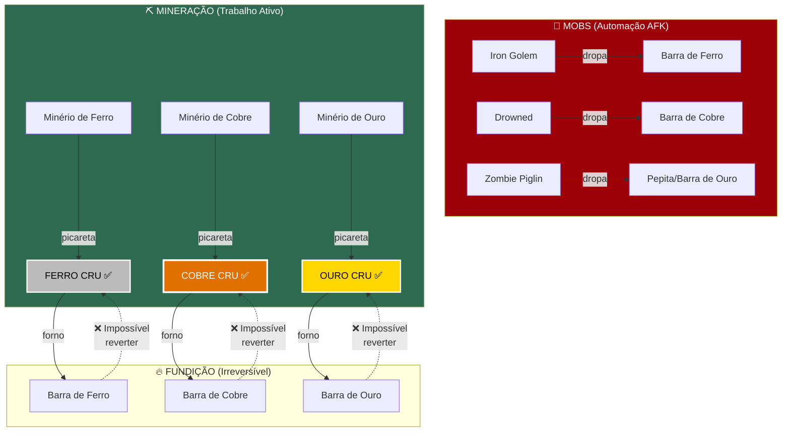

### 6.3. Proteção Contra X-Ray

Um contra-argumento legítimo à mineração manual é: "E se jogadores usarem hacks de X-ray para encontrar minérios instantaneamente?"

**Resposta técnica:** Servidores modernos baseados em **Paper** e **Purpur** possuem sistemas nativos de **Anti-X-ray (Engine Mode 2)** que resolvem este problema a nível de protocolo de rede:

**Como funciona:**

1. O servidor **não envia** os dados reais dos blocos invisíveis ao cliente
2. Em vez disso, envia **blocos falsos** (minérios aleatórios, pedra) para todas as posições que o jogador não pode ver legitimamente
3. Quando o jogador quebra um bloco adjacente, criando linha de visão, o servidor envia a informação real
4. Mods de X-ray no cliente veem apenas os blocos falsos — a informação real **nunca chega ao cliente**

```
Visão do Servidor (real):    Visão do Cliente com X-ray:
                              
  [Pedra][Pedra][Pedra]        [Ferro][Ouro][Pedra]
  [Pedra][COBRE][Pedra]   →    [Carvão][Diamante][Ferro]
  [Pedra][Pedra][Pedra]        [Ouro][Pedra][Carvão]
                              
  O cobre real é invisível     Tudo é falso — X-ray inútil
```

**Configuração recomendada (paper.yml):**

```yaml
anticheat:
  anti-xray:
    enabled: true
    engine-mode: 2  # Modo de ofuscação completa
    hidden-blocks:
      - copper_ore
      - deepslate_copper_ore
      - iron_ore
      - deepslate_iron_ore
      - gold_ore
      - deepslate_gold_ore
      - diamond_ore
      - deepslate_diamond_ore
      - emerald_ore
      - deepslate_emerald_ore
```

**Conclusão:** A integridade da escassez do Cobre Cru não depende da confiança nos jogadores ou da vigilância dos admins. Ela é garantida por **criptografia a nível de protocolo de rede** no servidor. Isso é segurança de nível industrial, não uma regra social.

---

## 7. O Dreno Industrial — Money Sink Orgânico

Um dos problemas mais críticos de qualquer moeda é a **inflação por acúmulo**. Mesmo que a moeda não seja farmável por AFK, ela ainda pode se acumular na economia se não houver mecanismo de remoção. Este é o problema do "colchão de diamantes" — jogadores acumulam riqueza sem gastá-la, e a massa monetária cresce indefinidamente.

A solução é o que economistas chamam de **money sink** — um mecanismo que remove moeda de circulação de forma orgânica.

### 7.1. Money Sinks do Cobre Cru

O Cobre Cru possui múltiplos money sinks, tanto em Vanilla quanto com mods:

#### Vanilla Minecraft

| Sink | Processo | Unidades consumidas |
|------|----------|-------------------|
| Construção decorativa | Fundir → Barras → Blocos de Cobre (oxidação decorativa) | 9 Cobre Cru / bloco decorativo |
| Telescópio (Spyglass) | Fundir → 2 Barras + 1 Ametista | 2 Cobre Cru / telescópio |
| Para-raios (Lightning Rod) | Fundir → 3 Barras | 3 Cobre Cru / para-raios |
| Cobre encerado (Waxed Copper) | Fundir → Blocos → Encerar com honeycomb | 9 Cobre Cru / bloco encerado |
| Copper Bulb (1.21+) | Fundir → componentes | Variável |
| Copper Grate (1.21+) | Fundir → 4 Blocos → 4 Grates | 36 Cobre Cru / 4 grates |

#### Create Mod (Sink Massivo)

O Create Mod transforma o cobre de um material decorativo em um **recurso industrial crítico**:

| Componente Create | Cobre necessário (em Barras → Cobre Cru equivalente) | Uso |
|-------------------|------------------------------------------------------|-----|
| Fluid Pipe | 3 barras = 3 Cobre Cru | Transporte de fluidos |
| Fluid Tank (mínimo 3x3) | 20+ barras = 20+ Cobre Cru | Armazenamento de fluidos |
| Mechanical Pump | 4+ barras = 4+ Cobre Cru | Bombeamento |
| Copper Casing | 1+ barras | Base de muitos componentes |
| Hose Pulley | 4+ barras | Drenagem/enchimento |
| Item Drain | 2+ barras | Coleta de fluidos |

Uma **fábrica completa** no Create Mod pode facilmente consumir **centenas a milhares** de Cobres Crus em barras. Um projeto de refinaria de petróleo ou destilaria pode consumir mais de **5.000 Cobres Crus** equivalentes.

### 7.2. A Dinâmica do Dreno

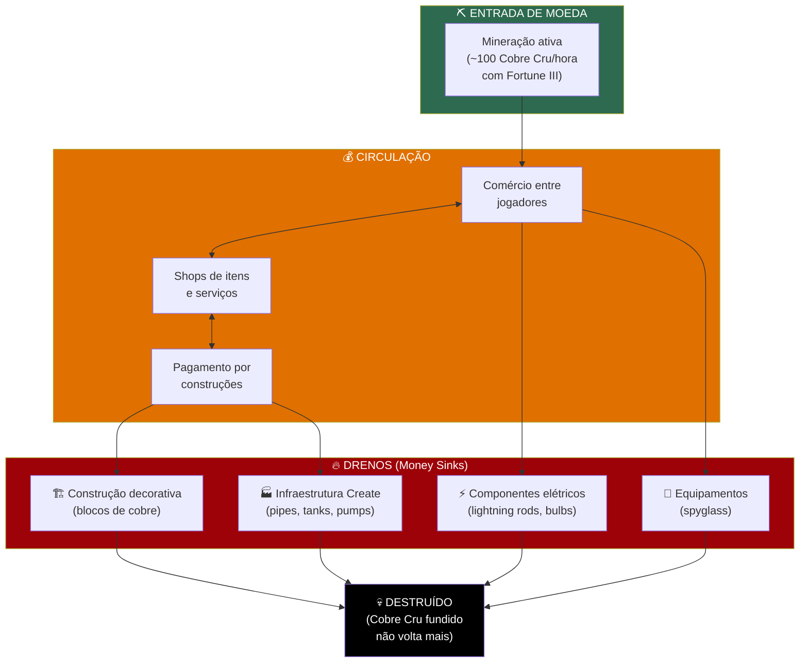

### 7.3. O Equilíbrio Automático

O brilhantismo desse sistema é que o dreno é **proporcional à prosperidade**:

| Fase do Servidor | Mineração (entrada) | Construção (dreno) | Resultado |
|-----------------|--------------------|--------------------|-----------|
| **Early game** | Baixa (picaretas de pedra/ferro) | Baixa (poucos projetos) | Equilíbrio — moeda estável |
| **Mid game** | Média (Fortune III, melhores técnicas) | Média (fábricas começam) | Equilíbrio — leve inflação compensada por dreno |
| **Late game** | Alta (Tunnel Bores, exploração em massa) | Alta (mega-fábricas, cidades inteiras) | Equilíbrio — dreno massivo compensa produção alta |
| **Endgame** | Diminui (minérios locais esgotam) | Continua (sempre há novos projetos) | Leve deflação — moeda se valoriza → incentiva exploração de novas áreas |

**Nenhum administrador precisa intervir.** O sistema se autoregula pela relação entre oferta (mineração) e demanda (construção industrial).

---

## 8. O Papel do Fortune III e da Automação de Mineração

### 8.1. Fortune III: Inflação ou Capital?

O encantamento Fortune III multiplica a média de drops por bloco de minério:

| Encantamento | Drop médio por bloco de Cobre | Multiplicador |
|-------------|-------------------------------|---------------|
| Sem Fortune | 2-5 (média ~3.5) | 1.0x |
| Fortune I | Média ~4.7 | ~1.33x |
| Fortune II | Média ~5.8 | ~1.67x |
| Fortune III | Média ~7.7 | ~2.2x |

**Objeção comum:** "Fortune III causa inflação! Mais cobre por bloco = moeda desvalorizada!"

**Contra-argumento:** Fortune III não é "dinheiro grátis" — é o retorno de um **investimento de capital** significativo:

Para obter Fortune III, o jogador precisa:
1. **Minerar diamantes** suficientes para criar uma picareta de diamante
2. **Construir uma farm de XP** ou minerar XP manualmente
3. **Obter livros** (via crafting, fishing, ou villagers — cada um com seu custo de tempo)
4. **Enchantar** na mesa de encantamentos (requer lápis-lazúli e níveis de XP)
5. Possivelmente **combinar encantamentos** na bigorna (com custo exponencial de XP)

O tempo investido para obter Fortune III é substancial — facilmente **5-15 horas** de jogo focado. O aumento de 2.2x na produção é o **retorno desse investimento**, não inflação gratuita.

Na terminologia da Escola Austríaca, Fortune III é um exemplo perfeito de **preferência temporal**: o jogador sacrifica produção presente (tempo gasto obtendo o encantamento) para aumentar produção futura (mais cobre por bloco). Isso é a definição literal de **formação de capital**.

### 8.2. Tunnel Bores e Drills (Create Mod)

O Create Mod permite construir máquinas de mineração automática (Tunnel Bores) que cavam túneis autonomamente. Isso não invalida a tese do Cobre Cru?

**Análise:**

| Aspecto | Tunnel Bore (Create) | AFK Mob Farm |
|---------|---------------------|--------------|
| Custo de construção | **Altíssimo** — centenas de componentes | Baixo a médio |
| Conhecimento necessário | Engenharia mecânica complexa | Tutoriais simples |
| Manutenção | Ativa — precisa de combustível, trilhos, supervisão | Zero |
| Velocidade de mineração | Moderada — mais lento que mineração manual eficiente | Infinita (AFK) |
| Recursos consumidos | Combustível, trilhos, manutenção mecânica | Nenhum |
| O jogador pode ser AFK? | Parcialmente — precisa supervisionar | Sim, 100% AFK |

**Conclusão:** Tunnel Bores no Create Mod são **máquinas de mineração**, não farms de mobs. Elas aceleram a mineração, mas não a tornam gratuita — exigem recursos, combustível, e manutenção. Mais importante: a construção da Tunnel Bore em si **consome barras de cobre**, funcionando como money sink. O jogador precisa gastar moeda (fundir Cobre Cru) para construir a máquina que vai gerar mais moeda (minerar mais Cobre Cru).

Isso cria um **ciclo de investimento de capital** natural:

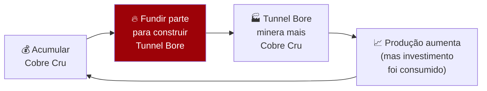

A taxa de retorno é positiva, mas **não é infinita nem gratuita** — exatamente como investimentos reais em capital produtivo.

---

## 9. Tabela Comparativa Geral — Todas as Moedas Candidatas

Esta tabela avalia cada moeda usando os 13 critérios definidos na Seção 3, com pontuação de 0-3:

| Critério | 💎 Diamante | 🌾 Trigo | ⭐ Nether Star | 🟧 Cobre Cru | ⬜ Ferro Cru | 🟨 Ouro Cru | ❤️ Min. Esmeralda | 🟤 Ancient Debris |
|----------|:-----------:|:--------:|:--------------:|:------------:|:------------:|:-----------:|:-----------------:|:-----------------:|
| **Escassez natural** | 2 | 0 | 2 | 3 | 2 | 3 | 3 | 3 |
| **Durabilidade** | 3 | 2 | 3 | 3 | 3 | 3 | 3 | 3 |
| **Divisibilidade** | 2 | 3 | 0 | 3 | 3 | 3 | 0 | 1 |
| **Fungibilidade** | 3 | 3 | 3 | 3 | 3 | 3 | 3 | 3 |
| **Portabilidade** | 2 | 2 | 1 | 3 | 3 | 3 | 1 | 1 |
| **Valor de uso** | 3 | 2 | 1 | 3 | 3 | 3 | 1 | 2 |
| **Não-farmável (mobs)** | 1 | 0 | 1 | 3 | 3 | 3 | 3 | 3 |
| **Não-farmável (máquinas)** | 1 | 0 | 1 | 2 | 2 | 2 | 3 | 2 |
| **Money Sink natural** | 2 | 2 | 0 | 3 | 2 | 2 | 0 | 1 |
| **Compressibilidade** | 1 | 2 | 1 | 3 | 3 | 3 | 1 | 1 |
| **Acessibilidade early-game** | 1 | 3 | 0 | 3 | 3 | 2 | 1 | 0 |
| **Independência admin** | 3 | 0 | 0 | 3 | 3 | 3 | 3 | 3 |
| **Anti-cheat nativo** | 2 | 1 | 2 | 3 | 3 | 3 | 3 | 2 |
| **TOTAL** | **26** | **20** | **15** | **38** | **36** | **34** | **25** | **25** |

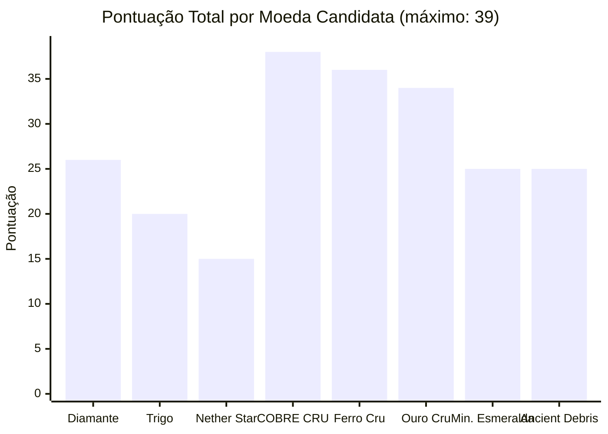

**Resultado:** O **Cobre Cru** obtém a pontuação mais alta (38/39), seguido por Ferro Cru (36) e Ouro Cru (34). As moedas tradicionais ficam significativamente abaixo.

---

## 10. Respondendo às Críticas — A Teoria Aplicada aos Frameworks Existentes

### 10.1. Resposta à Crítica Austríaca

**Crítica:** "O mercado deve escolher a moeda organicamente. Impor Cobre Cru é autoritarismo."

**Resposta:** Concordamos 100% com o princípio. A Teoria do Cobre Cru **não propõe impor** o Cobre Cru por decreto. Ela propõe que, se os jogadores tiverem informação completa sobre as propriedades dos itens, o Cobre Cru é o que o mercado **naturalmente escolheria**.

O papel do administrador não é impor a moeda, mas sim:
1. **Divulgar** as propriedades do Cobre Cru (não-farmabilidade, compressibilidade)
2. **Montar shops iniciais** precificados em Cobre Cru para criar um ponto focal (focal point de Schelling)
3. **Não proibir** nenhuma moeda alternativa — se jogadores preferirem diamantes, estão livres

Na teoria dos jogos, isso é chamado de **Ponto Focal de Schelling**: quando múltiplos equilíbrios são possíveis, um "ponto óbvio" pode emergir se os jogadores tiverem informação suficiente. O Cobre Cru, uma vez que suas propriedades são compreendidas, se torna o ponto focal natural.

### 10.2. Resposta à Crítica dos Sistemas de Servidor

**Crítica:** "Não existe moeda universal. Cada servidor precisa de uma moeda diferente."

**Resposta:** Concordamos parcialmente. O Cobre Cru não é a melhor moeda para **todos** os servidores. Especificamente:

| Tipo de Servidor | Cobre Cru é ideal? | Alternativa recomendada |
|------------------|--------------------|------------------------|
| SMP Industrial (Create Mod) | ✅ **Sim** — money sink perfeito | — |
| SMP Vanilla longo prazo | ✅ **Sim** — escassez natural funciona | — |
| SMP casual entre amigos | ⚠️ Funciona, mas diamantes são mais intuitivos | Diamantes (simplicidade > otimização) |
| Servidor de Anarquia | ⚠️ Sem shops centrais, difícil de adotar | Barter livre (a natureza da anarquia) |
| Servidor de Roleplay pesado | ✅ **Sim** — reforça imersão de "trabalho real" | — |
| Servidor PvP/Factions | ⚠️ Economia é secundária ao combate | Item que o plugin de factions usa |
| Skyblock/OneBlock | ❌ **Não** — mineração é mecânica diferente | Moeda do plugin específico |

### 10.3. Resposta à Crítica da Moeda-Tempo

**Crítica:** "Tempo é a verdadeira moeda. Itens são apenas proxies."

**Resposta:** Concordamos que tempo é a unidade fundamental de valor. A questão é: **qual proxy preserva a relação com tempo de forma mais estável?**

| Moeda | Tempo para obter 1 unidade | Estabilidade ao longo do tempo |
|-------|---------------------------|-------------------------------|
| Diamante | ~1.3 min (mas cai com Fortune III e villagers) | ❌ **Instável** — encurta com automação |
| Trigo | ~0.5 min (mas proibido automatizar) | ❌ **Artificial** — depende de proibições |
| Cobre Cru | ~0.5-0.8 min (Fortune III melhora mas não automatiza) | ✅ **Estável** — sempre requer mineração ativa |
| Ferro Cru | ~0.2-0.4 min (muito abundante) | ⚠️ **Desvaloriza** — abundância excessiva |

O Cobre Cru é o melhor proxy para tempo porque:
1. **Sempre** requer mineração ativa (nunca AFK)
2. Fortune III **melhora a eficiência** mas não elimina o trabalho
3. A taxa de coleta é relativamente **estável e previsível**

### 10.4. Resposta à Questão do "E se os Minérios Locais Acabarem?"

**Crítica:** "Em um servidor com world border, eventualmente todo o cobre da área será minerado. E aí?"

**Resposta:** Este é um cenário real que precisa ser endereçado. Existem três respostas:

**1. Expansão controlada de border:**
A escassez crescente de cobre cria **incentivo natural** para explorar novas áreas. Se o servidor usa borders, o aumento do preço do Cobre Cru funciona como sinal de mercado de que a borda deve ser expandida. Isso é um **mecanismo de feedback positivo** — a economia comunica ao admin quando é hora de expandir.

**2. Geração de chunks via exploração:**
Em servidores sem border, novos chunks são gerados conforme jogadores exploram. Cada chunk gera novos minérios. A taxa de expansão do mundo é naturalmente limitada pela velocidade de viagem dos jogadores.

**3. Reciclagem via comércio internacional:**
Se o servidor tem **múltiplas bases ou cidades**, o Cobre Cru fluirá naturalmente para onde há mais demanda industrial e para longe de onde há mais mineração. Isso cria **rotas de comércio** orgânicas — exatamente como nas economias reais pré-industriais.

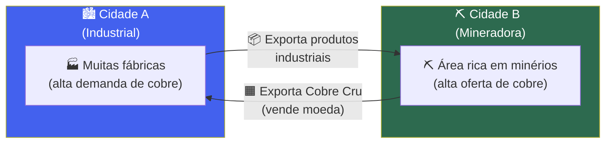

---

## 11. Guia de Implementação Prática

### 11.1. Para Servidores Vanilla

**Configuração mínima:**

1. **Informar jogadores** que o servidor adota Cobre Cru como moeda (não proibir alternativas)
2. **Configurar Anti-X-ray** (Engine Mode 2) no Paper/Purpur
3. **Criar um spawn shop** inicial com preços em Cobre Cru para estabelecer referência
4. **Sugerir tabela de preços inicial** (a ser ajustada pelo mercado):

| Item | Preço sugerido (Cobre Cru) |
|------|---------------------------|
| 1 Pão | 1-2 |
| 1 Stack de Cobblestone | 2-3 |
| 1 Picareta de Ferro | 8-12 |
| 1 Stack de Madeira | 3-5 |
| 1 Diamante | 15-25 |
| 1 Picareta de Diamante | 50-80 |
| 1 Netherite Ingot | 200-400 |
| 1 Elytra | 1.000-3.000 |
| 1 Totem of Undying | 100-200 |
| Terreno 16x16 (1 chunk) | 500-2.000 |

> **Nota:** Estes preços são pontos de partida. O mercado livre deve ajustá-los conforme oferta e demanda reais do servidor.

### 11.2. Para Servidores com Create Mod

Tudo acima, mais:

1. **Não alterar** receitas do Create que usam cobre — o money sink natural deve funcionar
2. **Considerar multiplicar custos** de cobre nas receitas Create se o servidor for pequeno (para equilibrar o dreno)
3. **Shops de componentes Create** precificados em Cobre Cru criam economia rica:
   - Shaft: 3-5 Cobre Cru
   - Cogwheel: 5-8 Cobre Cru
   - Andesite Alloy: 2-4 Cobre Cru
   - Fluid Pipe: 8-15 Cobre Cru

### 11.3. Sistema Multi-Tier (Avançado)

Para servidores que desejam uma economia sofisticada com múltiplas denominações, propomos o **Sistema Tri-Metálico Bruto**:

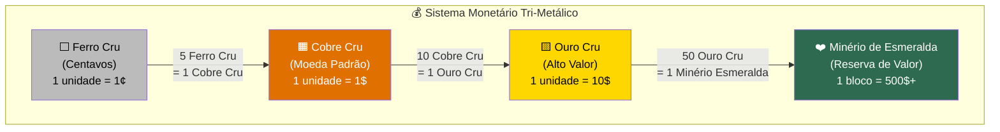

**Taxas de câmbio sugeridas (ponto de partida):**

| Conversão | Taxa |
|-----------|------|
| 5 Ferro Cru = 1 Cobre Cru | 5:1 |
| 10 Cobre Cru = 1 Ouro Cru | 10:1 |
| 50 Ouro Cru = 1 Bloco de Minério de Esmeralda (Deepslate) | 50:1 |

> **Nota:** Estas taxas devem ser determinadas pelo mercado, não por decreto. Os valores acima refletem aproximadamente o tempo relativo de mineração de cada recurso.

---

## 12. Casos Extremos e Limitações

### 12.1. Limitações Reconhecidas

A Teoria do Cobre Cru não é perfeita. Reconhecemos as seguintes limitações:

#### a) Dependência da Versão do Jogo

As loot tables e mecânicas de mineração podem mudar em futuras versões do Minecraft. Se a Mojang adicionar uma receita para "desfundir" barras em matéria-prima bruta, ou se um mob futuro dropar Cobre Cru, a tese precisaria ser revisada.

**Mitigação:** A assimetria bruto/processado existe desde a versão 1.17 (Caves & Cliffs) e se manteve por 5+ versões. Não há indicação de que a Mojang pretende alterar isso.

#### b) Servidores com Mods que Alteram Receitas

Mods como Industrial Craft, Thermal Expansion, ou outros mods técnicos podem adicionar receitas que convertem barras em matéria-prima bruta (pulverizadores, trituradores).

**Mitigação:** Verificar se o modpack do servidor possui essas receitas e, se necessário, removê-las via configuração do mod. Alternativamente, usar datapacks para garantir a irreversibilidade.

#### c) Duplicação (Duping)

Bugs de duplicação podem afetar qualquer moeda baseada em itens, incluindo Cobre Cru.

**Mitigação:** Servidores Paper/Purpur possuem proteção nativa contra os dupes mais comuns. Manter o servidor atualizado é essencial. Isso é um problema genérico que afeta QUALQUER moeda de commodity — não é específico do Cobre Cru.

#### d) Silk Touch + Fundição

Um jogador pode usar Silk Touch para extrair o bloco de minério inteiro e depois fundi-lo. Isso gera 1 Cobre Cru? Não — gera 1 Barra de Cobre. Ou seja, Silk Touch não gera Cobre Cru; ele gera o bloco de minério, que quando fundido produz uma barra (versão processada, não bruta).

**Isso reforça a tese:** Mesmo com Silk Touch, a única forma de obter Cobre Cru é quebrar o minério com uma picareta normal (sem Silk Touch). Silk Touch é, portanto, uma escolha com trade-off: preservar o bloco (para XP farm futura ou decoração) vs. obter Cobre Cru (para uso como moeda).

#### e) Novos Jogadores e Curva de Aprendizado

**Crítica:** "Novos jogadores não sabem o que é Cobre Cru."

**Resposta:** Cobre é encontrado em abundância no Overworld desde Y -16 até Y 112. É um dos primeiros minérios que um novo jogador encontra. Ao contrário de Nether Stars (que exigem acesso ao Nether, Wither Skeleton Skulls, e um boss fight), ou Ancient Debris (que exige bed mining no Nether), o Cobre Cru é acessível **desde o primeiro dia de jogo** com nada mais que uma picareta de pedra.

### 12.2. Cenários Testados

| Cenário | O que acontece? | A economia sobrevive? |
|---------|----------------|-----------------------|
| Um jogador acumula 10.000 Cobre Cru | Ele é rico, mas o suprimento total do servidor é limitado. Outros jogadores mineram mais para compensar. | ✅ Sim — deflação leve incentiva mineração |
| Todos os jogadores param de minerar | Oferta estagna, preços sobem, mineração se torna lucrativa novamente. | ✅ Sim — autocorreção de mercado |
| Um jogador constrói mega-fábrica (gasta 5.000 Cobre Cru em barras) | Enorme money sink. Oferta monetária cai. Cobre Cru se valoriza. Mineradores lucram mais. | ✅ Sim — dreno industrial funciona |
| Novo jogador entra no servidor | Minera cobre desde o primeiro dia. Consegue comprar itens básicos em horas. | ✅ Sim — baixa barreira de entrada |
| Border expandido, novos chunks gerados | Nova oferta de cobre entra na economia. Leve inflação. Preços ajustam. | ✅ Sim — expansão natural |
| Jogador tenta criar Drowned farm para cobre | Farm produz Barras de Cobre, não Cobre Cru. Economia não é afetada. | ✅ Sim — proteção mecânica |
| Bug de duplicação descoberto | Admins corrigem o bug. Itens duplicados podem ser rastreados e removidos. | ⚠️ Risco, mas igual a qualquer moeda |

---

## 13. Conclusão

### 13.1. Síntese

O debate sobre moedas em Minecraft tem sido polarizado entre autoritarismo (impor regras para forçar escassez) e laissez-faire (aceitar inflação como inevitável). A Teoria do Cobre Cru propõe uma terceira via:

> **Usar a mecânica do próprio jogo como base da política monetária.**

A assimetria entre itens brutos e processados — onde mobs dropam apenas versões processadas, e a fundição é irreversível — é uma propriedade do **código-fonte** do Minecraft, não uma regra de servidor. Isso significa que a escassez do Cobre Cru é:

- **Automática** — nenhum admin precisa vigiar
- **Incorruptível** — nenhum jogador pode contornar (sem mods)
- **Universal** — funciona em qualquer servidor Java Edition
- **Intuitiva** — jogadores não precisam entender economia para participar

### 13.2. A Resposta a Cada Problema Identificado na Literatura

| Problema | Como as teorias anteriores resolviam | Como o Cobre Cru resolve |
|----------|-------------------------------------|--------------------------|
| **Hiperinflação** | Proibir automação (Trigo) ou aceitar (Laissez-faire) | Item mecanicamente não-automatizável |
| **Autoritarismo** | Necessário para Trigo e Nether Stars | Zero regras administrativas necessárias |
| **Bank runs** | Risco inerente ao sistema de Nether Stars | Moeda física — não existe banco central |
| **Falta de divisibilidade** | Nether Stars (mín. 1.728) intratáveis | 1 Cobre Cru = 1 unidade. Perfeito. |
| **Falta de money sink** | Trigo pode ser comido (fraco) | Fundição industrial (forte e constante) |
| **Exclusão de novos jogadores** | Nether Stars: impossível no early game | Cobre: encontrado desde o primeiro dia |
| **Perda de imersão** | Livros assinados = menus abstratos | Item tangível, físico, minerado com suor |
| **Complexidade** | Reserva fracionária = difícil de entender | "Mine cobre, venda cobre." Simples. |
| **Teorema da Regressão** | Trigo viola (escassez artificial) | Cobre satisfaz (valor de uso pré-monetário) |
| **Problema do Conhecimento** | Admins precisam definir preços (Trigo/NS) | Mercado define preços livremente |

### 13.3. Visão Final

O Padrão Cobre Cru transforma a economia do servidor em algo que se assemelha às primeiras economias mercantis da humanidade: mineradores extraem riqueza da terra, artesãos a transformam em bens de capital, comerciantes facilitam trocas, e engenheiros constroem máquinas que amplificam a produtividade de todos. 

A moeda é tangível, honesta, e auto-regulada. Não há banco central para falir, não há admin para corromper, e não há farm para quebrar o sistema.

A economia passa a ser gerida por **leis de mercado puras**: os engenheiros vendem tecnologia e automação para poupar o tempo dos jogadores, enquanto os exploradores fornecem a liquidez e a matéria-prima minerada com o suor de suas picaretas.

O Cobre Cru estabelece, portanto, um ambiente virtual **economicamente robusto, imersivo e de crescimento sustentável** — e o faz sem exigir nada que o jogo não ofereça naturalmente.

---

## Apêndice A — Tabelas de Drop e Loot Tables

### A.1. Minério de Cobre

| Propriedade | Valor |
|-------------|-------|
| Geração | Y -16 a Y 112 (pico Y 48) |
| Blocos por veia | 6-20 (variável por bioma) |
| Drop sem Fortune | 2-5 Raw Copper |
| Drop com Fortune I | 2-10 Raw Copper (média ~4.7) |
| Drop com Fortune II | 2-15 Raw Copper (média ~5.8) |
| Drop com Fortune III | 2-20 Raw Copper (média ~7.7) |
| Drop com Silk Touch | 1 Copper Ore block |
| XP dropado | 0-3 por bloco |
| Biomas com bônus | Dripstone Caves (veias maiores) |

### A.2. Drowned (Afogado) — Loot Table

| Drop | Chance | Quantidade | Afetado por Looting |
|------|--------|-----------|---------------------|
| Rotten Flesh | 100% | 0-2 | Sim |
| **Copper Ingot** | **11%** | **1** | **Sim (+2% por nível)** |
| Trident (Java) | 6.25% (quando segurando) | 1 | Não |
| Fishing Rod | 3.75% (quando segurando) | 1 | Não |
| Nautilus Shell | 3% | 1 | Sim |

> **Nota crítica:** O Drowned dropa **Copper Ingot** (Barra de Cobre), **NUNCA** Raw Copper (Cobre Cru). Esta distinção é fundamental para a tese.

### A.3. Iron Golem — Loot Table

| Drop | Chance | Quantidade | Afetado por Looting |
|------|--------|-----------|---------------------|
| **Iron Ingot** | **100%** | **3-5** | **Sim (+1 por nível)** |
| Poppy | 100% | 0-2 | Não |

> **Nota crítica:** Iron Golems dropam **Iron Ingot** (Barra de Ferro), **NUNCA** Raw Iron (Ferro Cru).

### A.4. Zombie Piglin — Loot Table

| Drop | Chance | Quantidade | Afetado por Looting |
|------|--------|-----------|---------------------|
| Rotten Flesh | 100% | 0-1 | Sim |
| **Gold Nugget** | **100%** | **0-1** | **Sim** |
| **Gold Ingot** | **~2.5%** | **1** | **Sim (+1% por nível)** |

> **Nota crítica:** Zombie Piglins dropam **Gold Nuggets** e **Gold Ingots**, **NUNCA** Raw Gold (Ouro Cru).

---

## Apêndice B — Glossário de Termos

| Termo | Definição |
|-------|-----------|
| **AFK Farm** | Fazenda automatizada que funciona enquanto o jogador está ausente (Away From Keyboard) |
| **Money Sink** | Mecanismo que remove moeda de circulação, controlando inflação |
| **Proof of Work** | Princípio de que obter a moeda requer esforço ativo (trabalho real) |
| **Fungibilidade** | Propriedade de cada unidade monetária ser idêntica e intercambiável |
| **Reserva Fracionária** | Sistema bancário onde o banco empresta mais do que tem em depósito |
| **Bank Run** | Quando todos os depositantes tentam sacar ao mesmo tempo, causando insolvência |
| **Loot Table** | Tabela de código do jogo que define o que cada mob pode dropar |
| **Teorema da Regressão** | Teoria de Mises: dinheiro deve emergir de commodity com valor de uso prévio |
| **Preferência Temporal** | Teoria austríaca: humanos preferem satisfação presente a futura |
| **Fortune III** | Encantamento que multiplica drops de minérios (média 2.2x) |
| **Silk Touch** | Encantamento que extrai o bloco de minério inteiro em vez de drops |
| **Ponto Focal de Schelling** | Na teoria dos jogos, solução que emerge naturalmente quando agentes convergem |
| **Anti-X-ray** | Sistema do servidor que impede cheats de visão através de blocos |
| **Create Mod** | Modificação do Minecraft focada em engenharia mecânica e automação industrial |
| **Tunnel Bore** | Máquina do Create Mod que automatiza escavação de túneis |
| **Escassez Natural** | Escassez inerente ao item pelas mecânicas do jogo |
| **Escassez Artificial** | Escassez criada por regras administrativas externas ao jogo |

---

## Referências

### Fontes Primárias (Textos Analisados)

1. **Pine Cone LP** — "The Best Minecraft Server Currency" (Proposta do Padrão Trigo)
2. **KCJ** — "Nether Star-Backed Securities" (Proposta de moeda fiduciária com reserva fracionária)
3. **Untossable Salad** — Crítica austríaca às propostas de Trigo e Nether Stars
4. **Fonte 4** — Análise de tempo como moeda fundamental (Teoria do Tempo-Valor)
5. **Fonte 5** — Meta-análise: moeda como subsistema de design de servidor
6. **Fonte 6** — Taxonomia de problemas e soluções monetárias em Minecraft
7. **I'm Mr. Pib** — Proposta de borders, wheat como custo, PvP e protection stones

### Referências Teóricas

- **Mises, Ludwig von** — *The Theory of Money and Credit* (1912)
- **Hayek, Friedrich** — *The Use of Knowledge in Society* (1945)
- **Rothbard, Murray** — *The Case Against the Fed* (1994)
- **Böhm-Bawerk, Eugen von** — Teoria do Capital e Preferência Temporal
- **Schelling, Thomas** — *The Strategy of Conflict* (1960) — Pontos Focais

### Referências Técnicas

- Minecraft Wiki — Loot Tables (https://minecraft.wiki)
- Paper Documentation — Anti-X-ray Configuration
- Create Mod Wiki — Copper Recipes and Components

---

> *"A melhor moeda é aquela que não precisa de um governo para existir — apenas de leis da natureza. Em Minecraft, as leis da natureza são o código-fonte."*
>
> — Teoria do Cobre Cru, 2026
